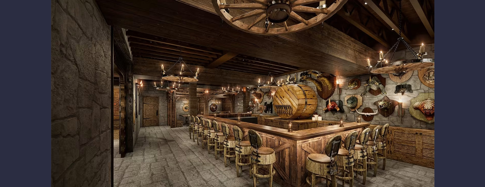
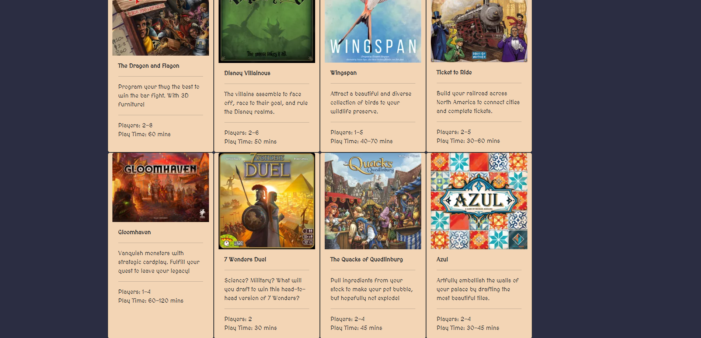
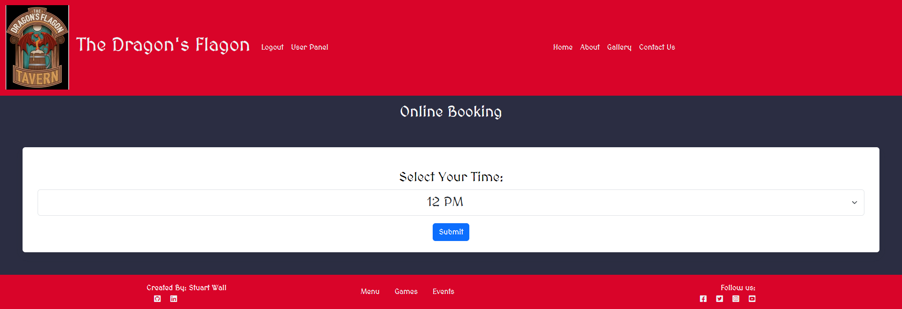
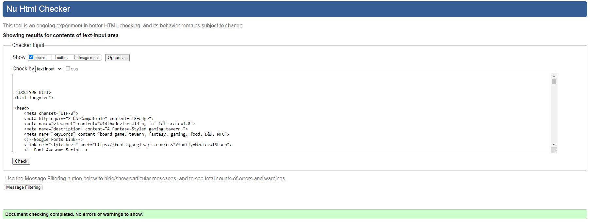
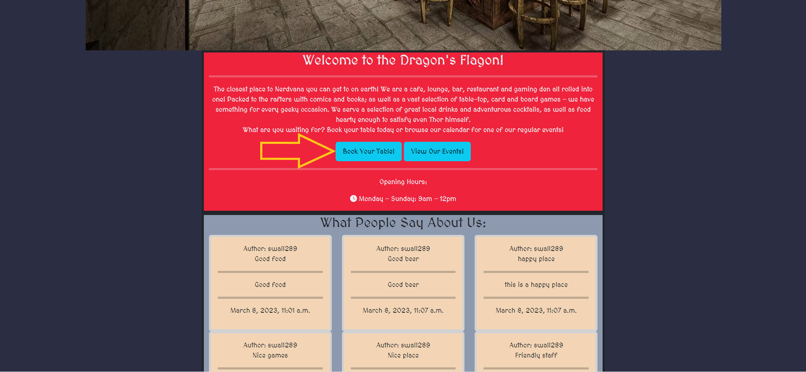

# The Dragon's Flagon | Gaming Tavern

**Developer: Stuart Wall**

💻 [Visit live website](https://ci-pp4-dragons-flagon-clinelly.herokuapp.com/)

## Table of Contents
  - [About](#about)
  - [User Goals](#user-goals)
  - [Site Owner Goals](#site-owner-goals)
  - [User Experience](#user-experience)
  - [User Stories](#user-stories)
  - [Design](#design)
    - [Colours](#colours)
    - [Fonts](#fonts)
    - [Structure](#structure)
      - [Website pages](#website-pages)
      - [Database](#database)
    - [Wireframes](#wireframes)
  - [Technologies Used](#technologies-used)
  - [Features](#features)
  - [Validation](#validation)
  - [Testing](#testing)
    - [Manual testing](#manual-testing)
    - [Automated testing](#automated-testing)
    - [Tests on various devices](#tests-on-various-devices)
  - [Bugs](#bugs)
  - [Heroku Deployment](#heroku-deployment)
  - [Credits](#credits)
  - [Acknowledgements](#acknowledgements)

### About
The Dragon's Flagon is a fantasy-themed tavern. It was designed primarily as a social spot for people to eat, drink, make merry and play a variety of tabletop/card/boardgames.

### User Goals
- To book a session at the tavern.
- To edit or delete a created booking.
- To be kept up-to-date with events.
- To view posts from the owners.
- To be able to contact the owners with questions or provide feedback.

### Site Owner Goals
- To enable users to book sessions at the tavern.
- To promote the business and attract customers.
- To keep customers up-to-date with news posts.
- To advertise events for customers to attend.
- To have an attractive and responsive website.

## User Experience

### Target Audience
- Users wishing to book a session at the tavern.
- New and repeat customers who wish to attend different events.
- Members of the gaming community who wish to have a social hub.
- Families looking for a fun place to eat and play.

### User Requirements and Expectations
- Accessible.
- Responsive.
- Key information (contact information & opening times).
- Social media links.
- Ease of use.
- Clean design.

##### Back to [top](#table-of-contents)

## User Stories

### Users
1.	As a User I can navigate across the site so that I can move to each feature of the site easily. (Must Have).
2.	As a User I can use a navbar, footer, and social icons so that I can navigate the site, access menus, and access socials. (Must Have).
3.	As a User I can view the opening hours and contact details so that I know when the business is open and how to contact them via email, phone and socials. (Must Have).
4.	As a User I can create a booking by selecting a date and time so that I can book a session. (Must Have).
5.	As a User I can update my booking so that I can choose another available time and date. (Must Have).
6.	As a User I can delete my booking so that I can cancel my session. (Must Have).
7.	As a user I can view my booking so that I can remind myself of the date and time I have booked. (Must Have).
8.	As a User I am notified when I take an action, so that I know my action of creating, editing, or deleting a booking has been successful. (Must Have).
9.	As a User I can register when prompted so that I can make a booking if I wish. (Must Have).
10.	As a User I can register an account so that I can access more advanced features of the site. (Must Have).
11.	As a user I can login so that I can book a session, leave a review or comment on a post. (Must Have).
12.	As a user I can see my login status so that I know if I am logged in or not. (Must Have).
13.	As a User I can view the site's blog so that I can learn additional information and read articles. (Must Have).
14.	As a User I can view the food, drink and game menus so that I can decide whether visit the business. (Must Have).
15.	As a User I cannot book a date in the past so that my booking is valid. (Must have).
16.	As a User, I can view events posted by the business so that I can decide to visit on certain days. (Must Have).
17.	As a user I can see reviews left by other users so that I can see if the business is any good. (Must Have).
18.	As a user I can post a review of my experience so that I can provide feedback of my visit. (Must Have).
19.	As a user, I can comment on blog posts to provide feedback so that I can join a social network. (Must Have).
20.	As a user, I can like/unlike blog posts so that I can provide feedback the the site owner on content quality. (Should Have).

### Admin / Authorised User
21.	As an Admin / Authorised User I can log in so that I can access the back end of the site. (Must Have).
22.	As an Admin / Authorised User I can manually add a booking so that I can book a table if someone phones, or emails the business. (Should Have).
23.	As an Admin / Authorised User I can login to add, edit or remove events from the calendar so I can advertise/change new events or cancel old ones. (Must Have).
24.	As an Admin / Authorised User I can create, read, update and delete blog posts so that I can provide information and updates to the users. (Must Have).
25.	As an Admin / Authorised User I can search through bookings, blogs, and events so that I can find the information I am looking for. (Should Have).
26.	As an Admin / Authorised User I can filter bookings by date so that I can see what bookings we have for a particular day (Should Have).
27.	As an Admin / Authorised User, I can moderate comments to keep a friendly online presence and maintain a professional website. (Should Have).

### Site Owner  
28.	As a Site Owner I can provide a 'Contact Us' page so that users can get in touch with my business. (Must Have).
29.	As a Site Owner, I can look at feedback provided by users, through reviews, comments and direct contact, so that I can make improvements where necessary. (Must Have)

### Kanban, Epics & User Stories

Epics & User Stories

#### Core Site Functionality
- As a User I can navigate across the site so that I can move to each feature of the site easily. (Must have)
- As a User I can use a navbar, footer, and social icons so that I can navigate the site, access menus, and access socials. (Must have)
- As a User I can view the opening hours and contact details so that I know when the business is open and how to contact them via email, phone and socials (Must have)
- As a User I can I am notified so that I know my action of creation, edit, or deletion of a booking has been successful (Must have)
- As a user I can login so that I can book a session. (Must have)
- As a user I can see my login status so that I know if I am logged in or not. (Must have)
- As a User I can view the site's blog so that I can learn additional information and read articles (Should have)
- As a User I can view the food and drink menu so that I can decide whether to eat at the business (Must have)
- As a User, I can view events posted by the business. (Must Have)
- As a user I can see reviews left by other users (Must have).
- As a user, I can comment on blog posts to provide feedback and join the discussion (must have).
- As a user, I can like/unlike blog posts (should have)
- As a Site Owner I can provide a fully responsive site for my customers so that they have a good user experience (Must have)
- As a Site Owner, I can look at feedback provided by users so that I can make improvements where necessary.

#### Admin Functionality
-	As an Admin / Authorised User I can log in so that I can access the back end of the site (Must have)
-	As an Admin / Authorised User I can manually add a booking so that I can book a table if someone phones, or emails the business (Should have)
-	As an Admin I can login to add or remove events from the calendar. (Must have)
-	As an Admin I can create, read, update and delete blog posts so that I can provide information and updates to the users. (Must have)
-	As an Admin / Authorised User I can search through bookings, so that I can find the information I am looking for (Should have)
-	As an Admin / Authorised User I can filter bookings by date so that I can see what bookings we have for a particular day (Should have).
-	As an admin/authorised user, I can moderate reviews/comments. (Should have)

#### CRUD Functionality
-	As a User I can create a booking by selecting a date and time so that I can book a session. (Must have)
-	As a User I can update my booking so that I can choose another available time and date (Must have)
-	As a User I can delete my booking so that I can cancel my session (Must have)
-	As a user I can view my booking so that I can remind myself of the date and time I have booked (Must have)
-	As a user I can post a review of my experience. (Must have)

#### Authentication functionality
-	As a Site Owner I can validate data entered into my site so that all submitted data is correct to avoid errors (Must have)
-	As a Site Owner I can provide a contact us page so that users can get in touch with my business (Must have)
-	As a User I can register as prompted so that I can make a booking if I wish. (Must have)
-	As a User I can register to create an account so that I can access more advanced features of the site. (Must have)
-	As a User I cannot book a date in the past so that my booking is valid (Must have)

Kanban

Finished Kanban

##### Back to [top](#table-of-contents)

## Design

### Colours
The colour palette was found on [Coolors.co](https://coolors.co/). I chose a palette with a similar colour-scheme to the main logo of the website.
Blue buttons draw the eye of the user and uploaded cards have a parchment coloured background to fit the fantasy theme.

View palette

### Fonts

The font chosen was Medieval Sharp from Google Fonts, as it resembles old-fashioned writing on a scroll. Cursive was chosen as a back-up font. 

### Structure

#### Website pages
The website was designed alongside standard principles to ensure users would be familiar with the layout. 
The header contains a navbar allowing users to navigate the main pages and to register/login. The navbar collapses to a menu on smaller screens.
A footer runs along the bottom of the webpages, promoting the website's social media links and more niche webpages.

Overall, the website has the following pages:
- A Home Page, providing the user with a brief description of the business. Buttons take the user to the Booking page and the Events page. Cards display user reviews and a button underneath takes users to the Review Submission page.
- An About Page, which provides the user more in-depth details about the website and the services it offers.
- The Gallery Page; which functions as a blog, allowing the site admins to publish photos/articles to the users. Clicking on a post enables users to comment on the posts.
- The Contact Page allows users to contact the site owners directly and provides direct contact details and a map to the business location.
- The Food & Drink page gives users a sample of what food/drink the tavern provides.
- The Games page provides users with a list of games the tavern has to offer.
- The Events page provides information about the regular events that take place at the tavern. A calendar provides users with dates and event names. Clicking on an event provides further details. Site admins can update/delete events.
- The User Panel page can be accessed from the header. It provides users with information about their bookings and their account information. By clicking on their booking, users can update or delete them.
- The Booking page can be accessed from the home page and allows users to book a session at the tavern.
- The Review Submission page is accessed from the home page and allows users to submit a review about their experience.

#### Database
Database schema created by using [django-extensions](https://django-extensions.readthedocs.io/en/latest/graph_models.html), pydot and [GraphVizOnline](https://dreampuf.github.io/GraphvizOnline/)

Show diagram

##### User Model
The User Model contains the following:
- user_id
- date_joined
- email
- first_name
- last_name
- is_active
- is_staff
- is_superuser
- last_login
- password
- username

##### Review Model
The Review Model contains the following:
- review_id
- author
- content
- created_on
- slug
- status
- title

##### Gallery Model
The Gallery Model contains the following:
- gallery_id
- author
- content
- created_on
- featured_image
- slug
- status
- title
- updated_on

##### Comment Model
The Comment Model contains the following:
- comment_id
- post
- approved
- body
- created_on
- name

##### TableBooking Model
The TableBooking Model contains the following:
- tablebooking_id
- user
- day
- email
- phone
- service
- time
- time_booked

##### Event Model
The Event Model contains the following:
- event_id
- description
- end_time
- start_time
- title

##### Contact Model
The Contact Model contains the following:
- message_id
- user
- created_date
- email
- message
- name
- phone

### Wireframes
Balsamiq was used ahead of development, in order to plan the basic skeleton of the major web-pages.

## Technologies Used

### Languages & Frameworks

- HTML
- CSS
- Javascript
- Python
- Django

### Libraries & Tools

- [Balsamiq](https://balsamiq.com/)
- [Bootstrap v5.2](https://getbootstrap.com/)
- [Cloudinary](https://cloudinary.com/)
- [Favicon.io](https://favicon.io)
- [Chrome dev tools](https://developers.google.com/web/tools/chrome-devtools/)
- [Font Awesome](https://fontawesome.com/)
- [Git](https://git-scm.com/)
- [GitHub](https://github.com/)
- [Google Fonts](https://fonts.google.com/)
- [Heroku Platform](https://id.heroku.com/login)
- [Postgres](https://www.postgresql.org/)
- [ElephantSQL](https://www.elephantsql.com/)
- [Summernote](https://summernote.org/)
- Validation:
  - [WC3 Validator](https://validator.w3.org/)
  - [Jigsaw W3 Validator](https://jigsaw.w3.org/css-validator/)
  - [Pycodestyle(PEP8)](https://pep8ci.herokuapp.com/)
  - [Lighthouse](https://developers.google.com/web/tools/lighthouse/)
  - [Wave Validator](https://wave.webaim.org/)

##### Back to [top](#table-of-contents)

## Features

### Header
Common to all web pages, the header contains the site logo and the navigation bar. The navigation links take the user to the different main pages of the website, the user panel, registration page and the login/logout.

Header

### Footer
Common to all web pages, the footer contains the links to the company's various social media accounts. It also contains links to the secondary web pages.

Footer

### Home Page

The Home Page contains a Hero Image of the bar interior, a small paragraph about the tavern as well as opening times. Buttons take the user to the Booking page and the Event Page. There is also a section that shows reviews from other users and a button which takes the user to the Review Submission page.

Home Page

### About Page

The About page has three sections giving more detail to the user about the business and the services on offer. Buttons take the user to the Food & Drink menu, the Games page and the Events page.

About Page

### Gallery Page

The Gallery page functions as a blog, allowing users to view posts, articles and images uploaded by the site admins/owners. Users can click on a gallery post to view it in more detail.

Gallery Page

### Gallery Detail Page

The Gallery Detail page provides users with more detail about the post they have clicked on. There is a section where users can comment on the post and a like/unlike functionality.

Gallery Detail Page

### Contact Page

The Contact page allows logged-in users to contact the business directly with questions and feedback. There is a section showing the location of the business on a map as well as external contact details for Guest users.

Contact Page

### Food Menu Page

The Food and Drink page provides users with a sample menu of what the tavern has to offer so they can make a decision to visit.

Food & Drink

### Game List Page

The Game List page provides users with a selection of board games on offer at the tavern.

Game List

### Events Page

The Events page has a number of paragraphs outlining the various regular events that the tavern hosts to provide information to the users who make be interested.
There is also a calendar that shows other events that can be navigated around and updated by site admins.

Events Page

### New Event Page

A page that can be navigated to by the site admins from the calendar which allows a new event to be created by filling in the form.

New Event Page

### Edit Event Page

A page that can be navigated to by the site admins from the calendar which allows an existing event to be edited by filling in the form.

Edit Event Page

### Delete Event Page

A page that can be navigated to by the site admins from the calendar which allows an existing event to be deleted by clicking the button.

Delete Event Page

### Booking Page

Users can navigate to this page from the Home page. Following the form inputs, users can select their desired date, time and service as well as leave their contact details.

Delete Event Page

### Review Submission Page

Authorised Users can navigate to this page from the Home page. The user can fill out the form and submit a short review about their experience at the Tavern.

Review Submission Page

### User Panel

Users that have logged in can access their User Panel from the Header. Here they can find their basic account information as well as any existing bookings they may have.

User Panel Page

### Edit Booking Page

From the User Panel, users can edit their booking to a different time and date. Following similar forms used to create their booking in the first place.

Edit Booking Page

### Delete Booking Page

From the User Panel, users can delete their booking.

Delete Booking Page

### User Registration

From the header, Guest users can register an account by filling in the form and fields.

User Registration Page

### Login/Logout

From the header, users with an account can log in using their credentials. Once logged in, they can log out by clicking on the link in the header.

Login/Logout Page

##### Back to [top](#table-of-contents)

## Validation

The W3C Markup Validation Service was usd to validate the HTML code used in the templates. All templates returned clear with no warnings or errors.

Index Page

Review Page

About Page

Gallery Page

Gallery Detail Page

Contact Page

Food Menu Page

Events Page

Create Event Page

Edit Event Page

Delete Event Page

Game List Page

Booking Page

Booking Submit Page

Edit Booking Page

Delete Booking Page

User Panel Page

### CSS Validation
The W3C Jigsaw CSS Validation Service was used to validate the CSS file used in the project. The CSS file returned clear with no errors or warnings.

Style.css

### JavaScript Validation
There are no custom JavaScript files in this project.

### PEP8 Validation
Code Institute's Python Linter App was used to check the validation of the Python code, as PEP8online is unavailable.
All custom python files reported as clear with no errors or issues.

Tavern

Admin.py

Models.py

Urls.py

Views.py

Forms.py

Tests.py

Booking

Admin.py

Models.py

Urls.py

Views.py

Contact

Admin.py

Models.py

Urls.py

Views.py

Forms.py

Events

Admin.py

Models.py

Urls.py

Views.py

Forms.py

Utils.py

### Lighthouse

Page Performance, Accessibility, Best Practice and SEO were tested using Google Lighthouse.
 
All templates scored above 90 on Performance and SEO. All Templates scored 83 on Best Practice due to issues Google raised with certain images, cookies and manifests.
 
The Gallery Detail page scored 87 on Accessibility with a warning about a conflict with the button name for the like/dislike feature for the gallery.

Index Page

Review Page

About Page

Gallery Page

Gallery Detail Page

Contact Page

Food Menu Page

Events Page

Create Event Page

Edit Event Page

Delete Event Page

Game List Page

Booking Page

Booking Submit Page

Edit Booking Page

Delete Booking Page

User Panel Page

### Wave
WAVE was used to test the main webpages accessibility. I had issues with Heroku not connecting to the WAVE webpage and was unable to test any webpages that required authentication.

6 Errors were shown due to empty links in the footer. Instead of text, I used Font Awesome icons for the Social Media links.

Home Page

About Page

Gallery Page

Gallery Detail Page

Two contrast errors were shown, due to the slight difference in tones from a liked/unliked item or a blog post with no comments on. I attempted to mitigate by increasing the font size.

Contact Page

Menu Page

Games Page

Events Page

Sign Up Page

Login Page

##### Back to [top](#table-of-contents)

## Testing

1. Manual testing
2. Automated testing

### Manual testing

1.	As a User I can navigate across the site so that I can move to each feature of the site easily.

**Step** | **Expected Result** | **Actual Result**
------------ | ------------ | ------------ |
| Click on 'Home' link in nav bar. | Home page loads.  | Works as expected. |
| Click on 'About' link in nav bar. | About page loads.  | Works as expected. |
| Click on 'Gallery' link in nav bar. | Gallery page loads.  | Works as expected. |
| Click on 'Contact' link in nav bar. | Contact page loads.  | Works as expected. |
| Click on 'Menu' link in footer. | Menu page loads.  | Works as expected. |
| Click on 'Games' link in footer. | Game page loads.  | Works as expected. |
| Click on 'Events' link in footer. | Event page loads.  | Works as expected. |

2.	As a User I can use a navbar, footer, and social icons so that I can navigate the site, access menus, and access socials.

**Step** | **Expected Result** | **Actual Result**
------------ | ------------ | ------------ |
| See test 1 | See test 1 | Works as expected. |
| Scroll down to footer | See footer.  | Works as expected. |
| Scroll down to footer | See social links.  | Works as expected. |

3.	As a User I can view the opening hours and contact details so that I know when the business is open and how to contact them via email, phone and socials.

**Step** | **Expected Result** | **Actual Result**
------------ | ------------ | ------------ |
| Navigate to home page, scroll down to welcome section. | See opening times. | Works as expected.|
| Navigate to contact page, scroll down to 'contact' section. | See opening times. | Works as expected.|
| See test 2 | See test 2 | Works as expected. |

4.	As a User I can create a booking by selecting a date and time so that I can book a session.

**Step** | **Expected Result** | **Actual Result**
------------ | ------------ | ------------ |
| Navigate to welcome section on home page, click book button | Taken to booking page. | Works as expected. |
| Select service and date, enter personal detail, select desired times, click submit | Booking created, redirected to home page. | Works as expected. |

5.	As a User I can update my booking so that I can choose another available time and date.

**Step** | **Expected Result** | **Actual Result**
------------ | ------------ | ------------ |
| Navigate to User Panel in header. | Taken to User Panel. | Works as expected. |
| Select edit booking. | Taken to exisitng booking. | Works as expected. |
| Select service and date, enter personal detail, select desired times, click submit | Booking created, redirected to home page. | Works as expected. |

6.	As a User I can delete my booking so that I can cancel my session.

**Step** | **Expected Result** | **Actual Result**
------------ | ------------ | ------------ |
| See Test 5. | See Test 5. | Works as expected. |
| Select saved booking, click delete button | Taken to confirm-deletion page. | Works as expected. |
| Click delete button | Booking deleted, message sent to user. | Works as expected. |

7.	As a user I can view my booking so that I can remind myself of the date and time I have booked.

**Step** | **Expected Result** | **Actual Result**
------------ | ------------ | ------------ |
| See Test 5. | See Test 5. | Works as expected. |
| From User Panel, scroll down. | View Booking details. | Works as expected. |

8.	As a User I am notified when I take an action, so that I know my action of creating, editing, or deleting a booking has been successful.

**Step** | **Expected Result** | **Actual Result**
------------ | ------------ | ------------ |
| See Test 4. | See Test 4. | Works as expected. |
| See Test 5. | See Test 5. | Works as expected. |
| See Test 6. | See Test 6. | Works as expected. |

10.	As a User I can register an account so that I can access more advanced features of the site.

**Step** | **Expected Result** | **Actual Result**
------------ | ------------ | ------------ |
| Navigate to header, click 'Register'. | Taken to registration page. | Works as expected. |
| Fill in form, click 'Register' button. | Account created. | Works as expected. |

11.	As a user I can login so that I can book a session, leave a review or comment on a post.

**Step** | **Expected Result** | **Actual Result**
------------ | ------------ | ------------ |
| Navigate to header, click login. | Taken to login page. | Works as expected. |
| Enter username and password. | User logged in and redirected to home page. | Works as expected. |

12.	As a user I can see my login status so that I know if I am logged in or not.

**Step** | **Expected Result** | **Actual Result**
------------ | ------------ | ------------ |
| Navigate to header. | 'Login' link replaced with 'Logout'. | Works as expected. |

13.	As a User I can view the site's blog so that I can learn additional information and read articles.

**Step** | **Expected Result** | **Actual Result**
------------ | ------------ | ------------ |
| See Test 1. | See Test 1. | Works as expected. |
| On Gallery page, click a blog entry. | Taken to more detailed gallery page. | Works as expected. |

14.	As a User I can view the food, drink and game menus so that I can decide whether visit the business.

**Step** | **Expected Result** | **Actual Result**
------------ | ------------ | ------------ |
| See Test 1. | See Test 1. | Works as expected. |
| On Food page, scroll down to view content. | Food and drink menus present. | Works as expected. |
| On Game page, scroll down to view content. | Game menu present. | Works as expected. |

15.	As a User I cannot book a date in the past so that my booking is valid.

**Step** | **Expected Result** | **Actual Result**
------------ | ------------ | ------------ |
| See Test 4 | See Test 4  | Works as expected. |
| When creating a booking, select date. | Can only book a selection of days ahead of todays date. | Works as expected. |

16.	As a User, I can view events posted by the business so that I can decide to visit on certain days.

**Step** | **Expected Result** | **Actual Result**
------------ | ------------ | ------------ |
| See Test 1 | See Test 1  | Works as expected. |
| On events page, scroll to view event content. | Regular events shown.  | Works as expected. |
| On events page, scroll to view calendar. | Populated calendar shown.  | Works as expected. |
| Click on event in calendar to view event details. | Event details shown.  | Works as expected. |

17.	As a user I can see reviews left by other users so that I can see if the business is any good.

**Step** | **Expected Result** | **Actual Result**
------------ | ------------ | ------------ |
| On Home page, scroll to review section. | Posted reviews shown.  | Works as expected. |
| In review section, click 'Next/Prev' to view paginated reviews. | Paginated reviews shown.  | Works as expected. |

18.	As a user I can post a review of my experience so that I can provide feedback of my visit.

**Step** | **Expected Result** | **Actual Result**
------------ | ------------ | ------------ |
| On Home page, scroll to review section, click 'Leave review' button. | Taken to review submission page. | Works as expected. |
| Fill in form and click submit. | Review posted. | Works as  expected. |

19.	As a user, I can comment on blog posts to provide feedback so that I can join a social network.

**Step** | **Expected Result** | **Actual Result**
------------ | ------------ | ------------ |
| See Test 13. | See Test 13. | Works as expected. |
| Fill in comment form. | Comment submitted. | Works as expected. |

20.	As a user, I can like/unlike blog posts so that I can provide feedback the the site owner on content quality.

**Step** | **Expected Result** | **Actual Result**
------------ | ------------ | ------------ |
| See Test 13. | See Test 13. | Works as expected. |
| Click 'Heart' icon under blog post. | Icon fills in and number is incremented. | Works as expected.|

21.	As an Admin / Authorised User I can log in so that I can access the back end of the site.

**Step** | **Expected Result** | **Actual Result**
------------ | ------------ | ------------ |
| Visit https://ci-pp4-dragons-flagon-clinelly.herokuapp.com/admin/login/?next=/admin/ and enter superuser credentials. | Login successful | Works as expected |
| Visit https://ci-pp4-dragons-flagon-clinelly.herokuapp.com/admin/ | Gain access to back end. | Works as expected |

22.	As an Admin / Authorised User I can login to add, edit or remove events from the calendar so I can advertise/change new events or cancel old ones.

**Step** | **Expected Result** | **Actual Result**
------------ | ------------ | ------------ |
| See Test 21. | See Test 21. | Works as expected. |
| Navigate to 'Events' under events. | Taken to events admin area. | Works as expected. |
| Select an event to edit or delete. | Event changed or deleted. | Works as expected. |
| Click 'add event', fill in form, click save. | New event created. | Works as expected. |

23.	As an Admin / Authorised User I can manually add a booking so that I can book a table if someone phones, or emails the business.

**Step** | **Expected Result** | **Actual Result**
------------ | ------------ | ------------ |
| See Test 21. | See test 21. | Works as expected. |
| Navigate to 'Table Bookings' under 'Bookings'. | Taken to Booking admin area. | Works as expected. |
| Click 'add booking', fill in form, click save. | New booking created. | Works as expected. |

24.	As an Admin / Authorised User I can create, read, update and delete blog posts so that I can provide information and updates to the users.

**Step** | **Expected Result** | **Actual Result**
------------ | ------------ | ------------ |
| See Test 21. | See Test 21. | Works as expected. |
| Navigate to 'Gallery' under Tavern. | Taken to gallery admin area. | Works as expected. |
| From Gallery area, can create, read, update and delete blog posts. | Full CRUD functionality for blog posts. | Works as expected. |

25.	As an Admin / Authorised User I can search through bookings, blogs, and events so that I can find the information I am looking for.

**Step** | **Expected Result** | **Actual Result**
------------ | ------------ | ------------ |
| See Test 21. | See Test 21 | Works as expected. |
| See Test 22. | See Test 22 | Works as expected. |
| See Test 23. | See Test 23 | Works as expected. |
| See Test 24. | See Test 24 | Works as expected. |
| Above each app, there is a search bar for information. | Search provides detailed information. | Works as expected. |

26.	As an Admin / Authorised User I can filter bookings by date so that I can see what bookings we have for a particular day.

**Step** | **Expected Result** | **Actual Result**
------------ | ------------ | ------------ |
| See Test 21. | See Test 21 | Works as expected. |
| See Test 23. | See Test 23 | Works as expected. |
| Booking filters shown on screen | Can filter by desired date. | Works as expected.|

27.	As an Admin / Authorised User, I can moderate comments to keep a friendly online presence and maintain a professional website.

**Step** | **Expected Result** | **Actual Result**
------------ | ------------ | ------------ |
| See Test 21. | See Test 21.  | Works as expected. |
| Navigate to Tavern app, click on comments. | Taken to comments section. | Works as intended. |
| Select comment, click on approve. | Hides comment on site. | Works as expected. |

28.	As a Site Owner I can provide a 'Contact Us' page so that users can get in touch with my business.

**Step** | **Expected Result** | **Actual Result**
------------ | ------------ | ------------ |
| See Test 1. | See Test 1.  | Works as expected. |
| Fill in form to contact site. | Contact form submits. | Works as expected. |

29.	As a Site Owner, I can look at feedback provided by users, through reviews, comments and direct contact, so that I can make improvements where necessary.

**Step** | **Expected Result** | **Actual Result**
------------ | ------------ | ------------ |
| See Test 18 | See test 18. | Works as expected. |
| See Test 19 | See test 19. | Works as expected. |
| See Test 20 | See test 20. | Works as expected. |
| See Test 28 | See test 28. | Works as expected. |

### Automated testing
Automated testing was used to test the Tavern app using the inbuilt test modules.
Coverage was used to write a report.

### Device Testing
The website was tested the following devices:
- Apple iPhone 11 Pro
- Google Pixel 6
- Samsung Galaxy 
- Google Acer Chromebook
- Microsoft Surface Pro

##### Back to [top](#table-of-contents)

## Bugs

| **Bug** | **Fix** |
| ------- | ------- |
| CSS file not loading.| Fixed typo in settings file. |
| URLs in templates not working correctly. | Empty string in Paths.py arguments. Typed in correct URL paths. |
| Reviews not showing. | Empty string in Paths.py arguments. Typed in correct URL paths. |
| Phone number input in booking causing data error. | Change model type field. |
| Template footer displaying inside calendar table. | Missing table closing tag. Changed Python code to generate correctly. |
| Possible to book a table session in the past. | Change python code to only allow date selections 24hrs ahead. |
| Unable to delete events. | Fixed typo in event views when passing context to template.|
| Gallery blog posts display 'p' tags. | This is due to the line break being rendered. Added 'safe' to django generated content.|

## Bugs to be Fixed

| **Bug** | **Attempted Fix** | **Work-around**|
| ------- | ------- |
| Calendar responsiveness on mobile sub-par.| Attempted generating 'table-responsive' class in the table elements around surround with 'container-fluid' class| Changed Bootstrap class to hide on smaller devices. |
| Reviews cannot be hidden unless deleted by admin. | Attempted Set up approval feature in admin.py, using statuses in models.py | Not critical - admin will have to moderate content via deletion for the moment. |

## Possible Future Features
 - Like/Unlike functionality to reviews.
 - Fully responsive event calendar.
 - Edit account information.
 - Remove bookings from user panel after date is passed.

##### Back to [top](#table-of-contents)

### Heroku Deployment

[Official Page](https://devcenter.heroku.com/articles/git) (Ctrl + click)
This application has been deployed from Github using Heroku. Here's how:

1. Create an account at heroku.com

2. Create an app. Give it a name such as ci-pp4-dragons-flagon (note: the name must be unique) and select a region. I set mine to Europe.

Heroku now charges for access to it's native postgres resources. I set up my project with [ElephantSQL](https://www.elephantsql.com/)

3. Go to elephantsql.com and create an account.

4. Go to your dashboard.

5. Select 'New Instance'.

6. Set up your plan: 
  - Give it a name (typically your project name)
  - Select the Tiny Turtle (free) package.
  - The Tags field can be left blank.

7. Select a Region (ideally, a data center located near you).

8. Click 'Review'.

9. Check your details are correct and click 'Create Instance'.

10. Return to the dashboard and click on the database instance name.

11. In the URL section, copy the URL to your clipboard.

12. Copy the database URL to your env.py file. It can also be set as an environmental variable in Heroku.

13. Install the plugins dj-database-url and psycopg2.

14. Run pip3 freeze > requirements.txt so both are added to the requirements.txt file.

15. Create a Procfile with the text: web: gunicorn dragonsflagon.wsgi.

16. In the settings.py ensure the connection is to the ElephantSQL database.

17. Ensure debug is set to false in the settings.py file.

18. Add localhost, and ci-pp4-dragons-flagon-clinelly.herokuapp.com to the ALLOWED_HOSTS variable in settings.py.

19. Run "python3 manage.py showmigrations" to check the status of the migrations.

20. Run "python3 manage.py migrate" to migrate the database.

21. Run "python3 manage.py createsuperuser" to create a super/admin user.

22. Install gunicorn and add it to the requirements.txt file using the command pip3 freeze > requirements.txt.

23. Disable collectstatic in Heroku before any code is pushed using the command heroku config:set DISABLE_COLLECTSTATIC=1 -a ci-pp4-dragons-flagon-clinelly.

24. Set the Config Vars in the Heroku app:
  - Your Elephant SQL Database.
  - Port 8000.
  - Your secret key.

25. Connect the app to GitHub, and enable automatic deploys from main if desired.

26. Click deploy to deploy your application to Heroku for the first time.

27. Click on the link provided to access the application.

28. If you encounter any issues accessing the build logs is a good way to troubleshoot the issue.

### Fork Repository
In order to fork the repository, you must:

- Go to the GitHub repository.
- Click on 'Fork' button in upper right hand corner.
- Select 'Create new fork' from the drop-down menu

### Clone Repository
You can clone the repository by following these steps:
- Going to the GitHub repository.
- Clicking the 'Code' button, loacted above the file list.
- Selecting if you prefer to clone using either HTTPS, SSH, or Github CLI.
- Clicking the copy button to copy the URL to your clipboard.
- Opening Git Bash.
- Changing the current working directory to one where you want to clone the directory to.
- Typing 'git clone' and pasting the URL from the clipboard ($ git clone https://github.com/YOUR-USERNAME/YOUR-REPOSITORY)
- Pressing 'Enter' to create your local clone.

The repository can be found here - https://github.com/Clinelly/CI_PP4_Dragons_Flagon

##### Back to [top](#table-of-contents)

## Credits

### Images
[Dragon’s Flagon logo](https://ih1.redbubble.net/image.1434837373.0468/flat,750x,075,f-pad,750x1000,f8f8f8.jpg)
Designed and sold on [Redbubble](https://www.redbubble.com/) by [Carl Huber](https://www.redbubble.com/people/carlhuber/shop)

Board Game Images were taken from [BoardGameGeek](https://boardgamegeek.com/)

Tavern Hero Image taken from [DDOPlayers](https://ddoplayers.com/2021/11/25/immersive-dd-inspired-restaurant-and-amusement-center-planned-in-lake-geneva/)

### Code
The code for the Events app was inspired by and modified from a tutorial by [Hui Wen]( https://www.huiwenteo.com/normal/2018/07/24/django-calendar.html)

The code for the Booking app was inspired by and modified from a tutorial by [John Abdsho Khosrowabadi](https://blog.devgenius.io/django-tutorial-on-how-to-create-a-booking-system-for-a-health-clinic-9b1920fc2b78)

The code for writing tests was inspired by a YouTube tutorial on testing by [The Dumbfounds](https://www.youtube.com/playlist?list=PLbpAWbHbi5rMF2j5n6imm0enrSD9eQUaM)

[Code Institute's](https://codeinstitute.net/) Hello Django and I Think Therefore I Blog walkthrough challenges.

[Stack Overflow](https://stackoverflow.com/) helped with answering niche questions.

[Django Documentation](https://docs.djangoproject.com/en/4.1/)

[Bootstrap Documentation](https://getbootstrap.com/docs/5.3/getting-started/introduction/)

##### Back to [top](#table-of-contents)

## Acknowledgements

### Special thanks to the following:
- My beautiful wife Megan, who's love and support has kept me going.
- My mentor Mo Shami who continually pushes me to be a better developer.
- Code Institute's fantastic tutor team, who are the fountain of all knowledge.
- The class of June '22, for their humour and insight.